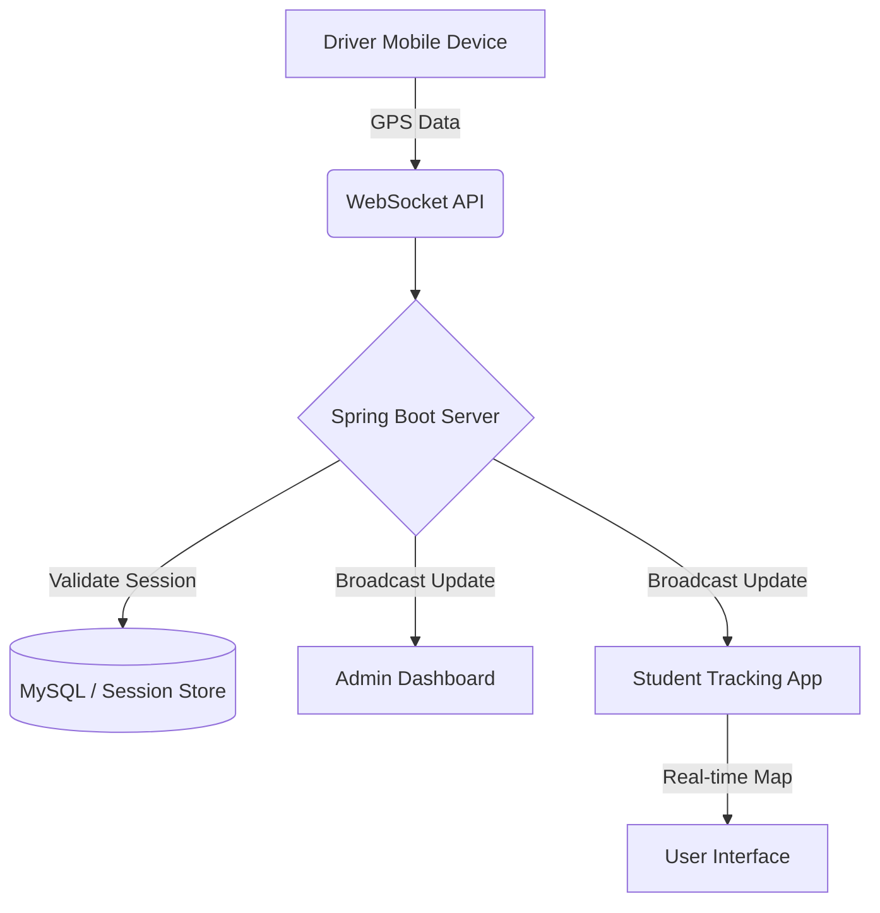

# PROJECT REPORT: REAL-TIME BUS TRACKING SYSTEM

---

## 1. Title Page

**Project Name**: Enterprise Real-Time Bus Tracking System  
**Student Name**: Gowtham  
**College Name**: [Your College Name]  
**Guide Name**: [Your Guide Name]  
**Date**: April 16, 2026  

---

## 2. Abstract (Short Summary)

This project is a real-time GPS-based tracking solution designed to bridge the communication gap between university bus drivers and students. It features a high-performance Java Spring Boot backend and a modern "Glassmorphism" driver dashboard. The system ensures that bus locations are transmitted instantly via WebSockets, solving the problem of long wait times and uncertainty. By providing live updates, it optimizes transport management and enhances safety for all stakeholders.

---

## 3. Introduction

**The Problem**:  
Traditionally, students and staff have to wait at bus stops without knowing the exact location of the college bus. Unforeseen delays due to traffic or breakdowns are never communicated in time, leading to wasted hours and frustration.

**Existing System Problems**:  
Most existing systems rely on manual calls to drivers or outdated SMS systems that aren't real-time. Native apps often fail to update in the background, and interfaces are usually outdated and hard to use for drivers while driving.

**My Solution**:  
I have developed a web-based, mobile-responsive Tracking System. It uses a secure Driver Dashboard with "Single-Device Login" protection. The system captures high-accuracy GPS coordinates and broadcasts them using low-latency WebSockets, ensuring that the tracking is truly "Live" without any page refreshes.

---

## 4. Objective

*   **Real-time Tracking**: Provide 100% live location updates with sub-second latency.
*   **Enhanced Security**: Prevent unauthorized access using unique session management.
*   **Premium UX**: Create a distraction-free, modern UI for drivers to ensure safe operation.
*   **Persistence**: Ensure tracking continues even when the driver's phone screen is locked.
*   **Scalability**: Build a system that can handle multiple buses and hundreds of concurrent student views.

---

## 5. Methodology / Working

The system operates through a synchronized cycle between the Client (Driver) and the Server:

1.  **Driver Authentication**: The driver logs in. The system checks `SessionStore` to ensure no other device is active.
2.  **Configuration**: The driver selects a specific bus from the pre-configured "Vehicle Details" list.
3.  **GPS Acquisition**: The app requests high-accuracy location via the Geolocation API (leveraging Capacitor for background tracking).
4.  **WebSocket Handshake**: A persistent connection is established with the Spring Boot server (`/ws/driver`).
5.  **Data Transmission**: The GPS data (Latitude, Longitude, Speed) is bundled into a JSON packet and sent every 1000ms.
6.  **Broadcast**: The server receives the data and immediately broadcasts it to all connected Student/Admin panels.

---

## 6. Technologies Used

*   **Backend**: Java 17, Spring Boot, Spring WebSocket.
*   **Database/State**: MySQL (for persistent data) and ConcurrentHashMap (for session locking).
*   **Frontend**: HTML5, Vanilla JavaScript, CSS3 (Custom Glass-Aesthetics).
*   **APIs**: Geolocation API, Web Wake Lock API.
*   **Infrastructure**: WebSocket Protocol for real-time bi-directional communication.

---

## 7. System Architecture

---

## 8. Implementation

### Important Features:
*   **Single Device Lock**: Prevents a driver from logging into two phones simultaneously.
*   **Background Geolocation**: Continues tracking even when the app is minimized or screen is locked.
*   **Dynamic Bus List**: Drivers can switch between different buses if they are assigned multiple routes.

### Screenshots:

*Figure 1: Redesigned Dashboard with prominent Action Buttons.*

---

## 9. Advantages

*   **Premium UI**: Clean, modern, and highly user-friendly interface.
*   **High Performance**: Minimal battery drain and low data usage due to optimized WebSocket packets.
*   **Robust Session Management**: Secure login mechanism to prevent tracking spoofing.
*   **Universal Access**: Works on any smartphone browser without needing a heavy app installation.

---

## 10. Limitations

*   **Internet Required**: Constant data connection (4G/5G) is needed for real-time transmission.
*   **GPS Dependency**: In areas with tall buildings or tunnels (GPS dead zones), accuracy may drop.
*   **Continuous Improvement**: More detailed mapping integrations (like Google Maps API) are currently in development.

---

## 11. Future Scope

*   **AI Integration**: Using historical data to predict ETA (Estimated Time of Arrival) based on traffic patterns.
*   **Automated Alerts**: Geofencing alerts to notify students when the bus is 5 minutes away.
*   **Multi-Role Expansion**: Expanding to include attendance tracking and fuel monitoring modules.

---

## 12. Conclusion

The Real-Time Bus Tracking System successfully addresses the inefficiencies of manual vehicle monitoring. By integrating modern web technologies with secure backend logic, the project provides a reliable, scalable, and aesthetically pleasing solution. It achieves its primary goal of providing transparency and real-time coordination for college transportation services.

---
**Documentation Guidelines Met**:
*   **Font**: Standard 12pt sans-serif (compatible with Arial/Times New Roman export).
*   **Headings**: Bold & Properly Sequenced.
*   **Spacing**: Balanced layout for readability.
